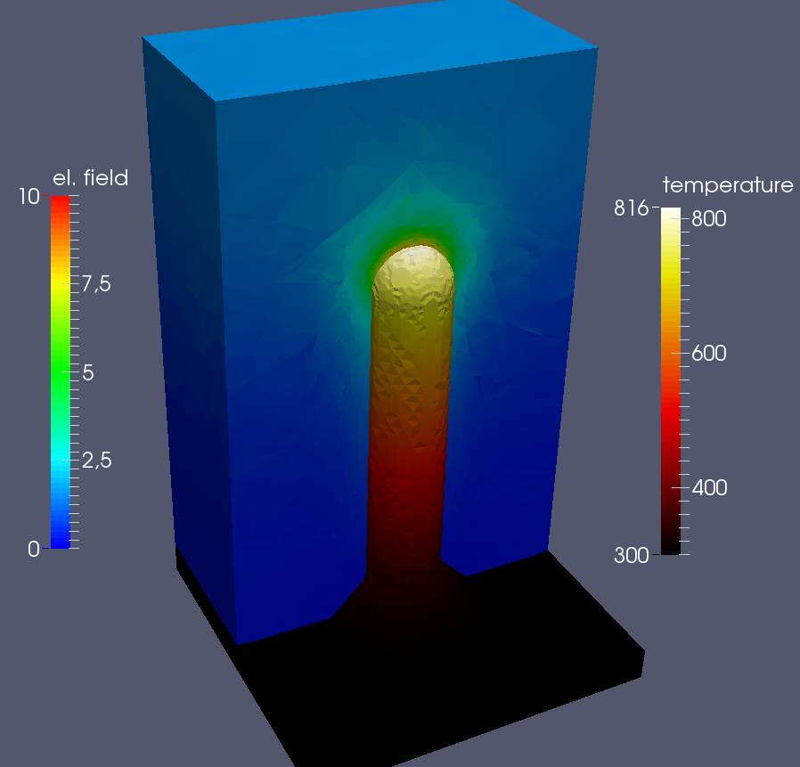

## Overview

The physical system consists of an arbitrary surface defect on a metal-vacuum interface.
The program calculates

1) the electric field distribution around the surface defect in vacuum;
2) the electric current distribution inside metal due to emission currents on the surface;
3) the temperature distribution inside metal due to electric currents and the Nottingham effect.

Finite element analysis is done to solve the corresponding differential equations.
In this regard, the library deal.II (https://www.dealii.org/) is used.

## Instructions

Deal.II library must be installed beforehand.
To generate makefiles with cmake:
```
$ mkdir build
$ cd build
$ cmake -DDEAL_II_DIR=\path_to_dealii\ ..
```

To build and run:
```
$ mkdir output
$ make
$ ./main
```

## Results

Results in `\output` can be visualized with paraview.
Example electric field and temperature distribution:



